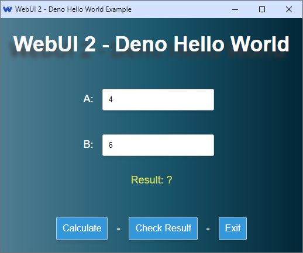

<div align="center">


# Deno-WebUI v2.5.10 (Beta)

[last-commit]: https://img.shields.io/github/last-commit/webui-dev/webui?style=for-the-badge&logo=github&logoColor=C0CAF5&labelColor=414868
[release-version]: https://img.shields.io/github/v/tag/webui-dev/webui?style=for-the-badge&logo=webtrees&logoColor=C0CAF5&labelColor=414868&color=7664C6
[license]: https://img.shields.io/github/license/webui-dev/webui?style=for-the-badge&logo=opensourcehardware&label=License&logoColor=C0CAF5&labelColor=414868&color=8c73cc

[![][last-commit]](https://github.com/webui-dev/deno-webui/pulse)
[![][release-version]](https://github.com/webui-dev/deno-webui/releases/latest)
[![][license]](https://github.com/webui-dev/deno-webui/blob/main/LICENSE)

> Use any web browser or WebView as GUI, with your preferred language in the
> backend and modern web technologies in the frontend, all in a lightweight
> portable library.


</div>

## Download

- [Latest Stable Release](https://github.com/webui-dev/deno-webui/releases)

## Features

- Portable (_Needs only a web browser or a WebView at runtime_)
- Lightweight (_Few Kb library_) & Small memory footprint
- Fast binary communication protocol
- Multi-platform & Multi-Browser
- Using private profile for safety
- Cross-platform WebView

## Screenshot

This
[hello world example](https://github.com/webui-dev/deno-webui/tree/main/examples/hello_world)
is written in Deno using WebUI as the GUI library.



## Installation

Specific version:

```js
import { WebUI } from "jsr:@webui/deno-webui@2.5.10";
// Or
import { WebUI } from "https://deno.land/x/webui@2.5.10/mod.ts";
```

Latest version:

```js
import { WebUI } from "jsr:@webui/deno-webui";
// Or
import { WebUI } from "https://deno.land/x/webui/mod.ts";
```

## Minimal Example

```js
import { WebUI } from "jsr:@webui/deno-webui";

const myWindow = new WebUI();
await myWindow.show(
  '<html><script src="webui.js"></script> Hello World! </html>',
);
await WebUI.wait();
```

```sh
deno run --allow-read --allow-write --allow-net --allow-env --allow-ffi minimal.ts
```

[More examples](https://github.com/webui-dev/deno-webui/tree/main/examples)

## Documentation

- [Online Documentation](https://webui.me/docs/2.5/#/)

## CppCon 2019 Presentation

[Borislav Stanimirov](https://ibob.bg/) explained at
[C++ Conference 2019 (_YouTube_)](https://www.youtube.com/watch?v=bbbcZd4cuxg)
how beneficial it is to use the web browser as GUI.

<!-- <div align="center">
  <a href="https://www.youtube.com/watch?v=bbbcZd4cuxg"></a>
</div> -->


## UI & The Web Technologies

Web application UI design is not just about how a product looks but how it
works. Using web technologies in your UI makes your product modern and
professional, And a well-designed web application will help you make a solid
first impression on potential customers. Great web application design also
assists you in nurturing leads and increasing conversions. In addition, it makes
navigating and using your web app easier for your users.

## Why Use Web Browser?

Today's web browsers have everything a modern UI needs. Web browsers are very
sophisticated and optimized. Therefore, using it as a GUI will be an excellent
choice. While old legacy GUI lib is complex and outdated, a WebView-based app is
still an option. However, a WebView needs a huge SDK to build and many
dependencies to run, and it can only provide some features like a real web
browser. That is why WebUI uses real web browsers to give you full features of
comprehensive web technologies while keeping your software lightweight and
portable.

## How does it work?


Think of WebUI like a WebView controller, but instead of embedding the WebView
controller in your program, which makes the final program big in size, and
non-portable as it needs the WebView runtimes. Instead, by using WebUI, you use
a tiny static/dynamic library to run any installed web browser and use it as
GUI, which makes your program small, fast, and portable. **All it needs is a web
browser**.

## Runtime Dependencies Comparison

|                                 | Tauri / WebView   | Qt                         | WebUI               |
| ------------------------------- | ----------------- | -------------------------- | ------------------- |
| Runtime Dependencies on Windows | _WebView2_        | _QtCore, QtGui, QtWidgets_ | **_A Web Browser_** |
| Runtime Dependencies on Linux   | _GTK3, WebKitGTK_ | _QtCore, QtGui, QtWidgets_ | **_A Web Browser_** |
| Runtime Dependencies on macOS   | _Cocoa, WebKit_   | _QtCore, QtGui, QtWidgets_ | **_A Web Browser_** |

## Supported Web Browsers

| Browser         | Windows         | macOS         | Linux           |
| --------------- | --------------- | ------------- | --------------- |
| Mozilla Firefox | ✔️              | ✔️            | ✔️              |
| Google Chrome   | ✔️              | ✔️            | ✔️              |
| Microsoft Edge  | ✔️              | ✔️            | ✔️              |
| Chromium        | ✔️              | ✔️            | ✔️              |
| Yandex          | ✔️              | ✔️            | ✔️              |
| Brave           | ✔️              | ✔️            | ✔️              |
| Vivaldi         | ✔️              | ✔️            | ✔️              |
| Epic            | ✔️              | ✔️            | _not available_ |
| Apple Safari    | _not available_ | _coming soon_ | _not available_ |
| Opera           | _coming soon_   | _coming soon_ | _coming soon_   |

## Supported Languages

| Language       | v2.4.0 API     | v2.5.0 API     | Link                                                              |
| -------------- | -------------- | -------------- | ----------------------------------------------------------------- |
| Python         | ✔️             | _not complete_ | [Python-WebUI](https://github.com/webui-dev/python-webui)         |
| Go             | ✔️             | _not complete_ | [Go-WebUI](https://github.com/webui-dev/go-webui)                 |
| Zig            | ✔️             | _not complete_ | [Zig-WebUI](https://github.com/webui-dev/zig-webui)               |
| Nim            | ✔️             | _not complete_ | [Nim-WebUI](https://github.com/webui-dev/nim-webui)               |
| V              | ✔️             | _not complete_ | [V-WebUI](https://github.com/webui-dev/v-webui)                   |
| Rust           | _not complete_ | _not complete_ | [Rust-WebUI](https://github.com/webui-dev/rust-webui)             |
| TS / JS (Deno) | ✔️             | _not complete_ | [Deno-WebUI](https://github.com/webui-dev/deno-webui)             |
| TS / JS (Bun)  | _not complete_ | _not complete_ | [Bun-WebUI](https://github.com/webui-dev/bun-webui)               |
| Swift          | _not complete_ | _not complete_ | [Swift-WebUI](https://github.com/webui-dev/swift-webui)           |
| Odin           | _not complete_ | _not complete_ | [Odin-WebUI](https://github.com/webui-dev/odin-webui)             |
| Pascal         | _not complete_ | _not complete_ | [Pascal-WebUI](https://github.com/webui-dev/pascal-webui)         |
| Purebasic      | _not complete_ | _not complete_ | [Purebasic-WebUI](https://github.com/webui-dev/purebasic-webui)   |
| -              |                |                |                                                                   |
| Common Lisp    | _not complete_ | _not complete_ | [cl-webui](https://github.com/garlic0x1/cl-webui)                 |
| Delphi         | _not complete_ | _not complete_ | [WebUI4Delphi](https://github.com/salvadordf/WebUI4Delphi)        |
| C#             | _not complete_ | _not complete_ | [WebUI4CSharp](https://github.com/salvadordf/WebUI4CSharp)        |
| WebUI.NET      | _not complete_ | _not complete_ | [WebUI.NET](https://github.com/Juff-Ma/WebUI.NET)                 |
| QuickJS        | _not complete_ | _not complete_ | [QuickUI](https://github.com/xland/QuickUI)                       |
| PHP            | _not complete_ | _not complete_ | [PHPWebUiComposer](https://github.com/KingBes/php-webui-composer) |

## Supported WebView

| WebView           | Status |
| ----------------- | ------ |
| Windows WebView2  | ✔️     |
| Linux GTK WebView | ✔️     |
| macOS WKWebView   | ✔️     |

### License

> Licensed under MIT License.

### Stargazers

[](https://github.com/webui-dev/deno-webui/stargazers)
